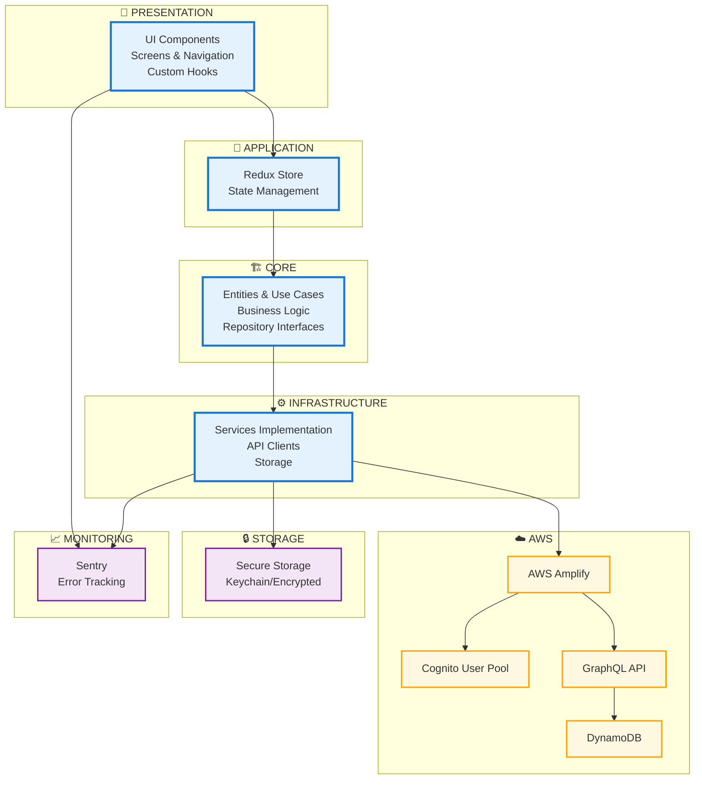
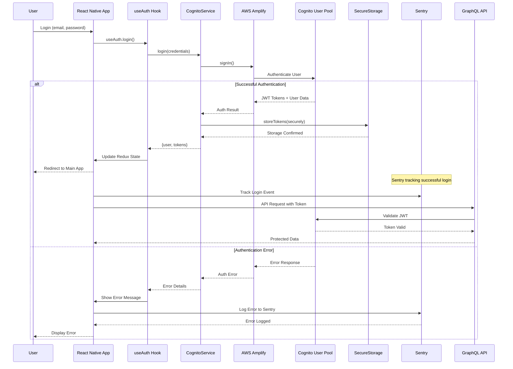
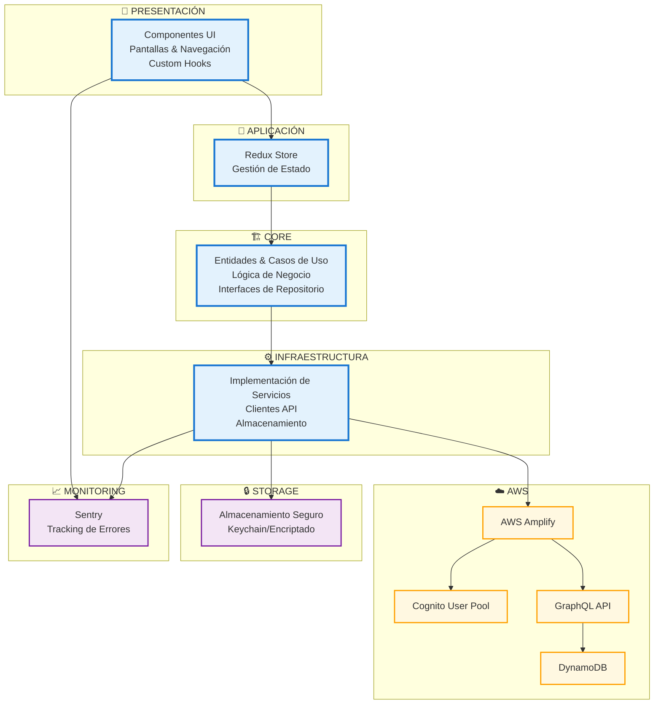
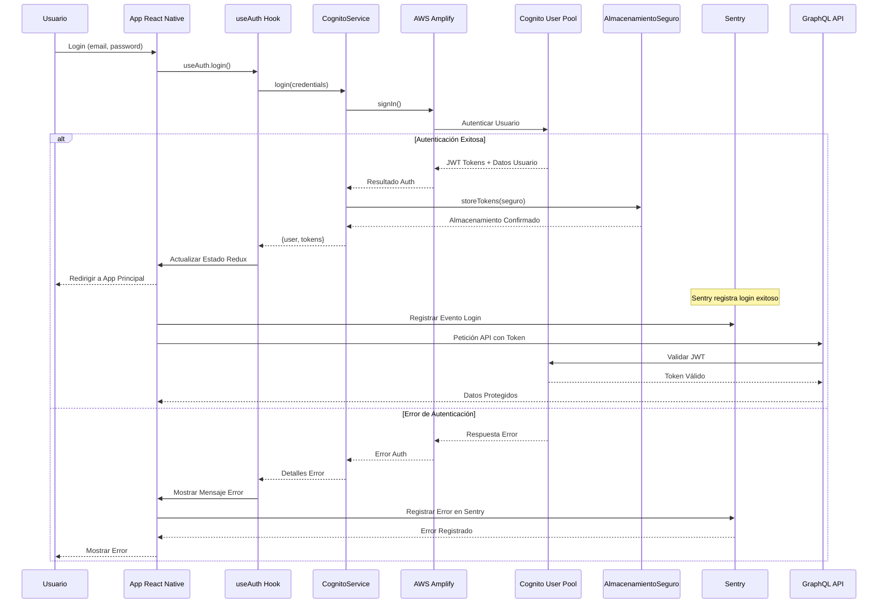

# Diagrama de Componentes: AWS Cognito React Native App

Diagramas visuales y arquitectura detallada del proyecto React Native con autenticación AWS Cognito.

## 📱 Aplicación de Gestión de Tareas con Autenticación AWS Cognito

Una aplicación React Native lista para producción que implementa autenticación y autorización segura usando AWS Cognito, con gestión de tareas y permisos basados en scopes.

### 🏗️ High-Level Architecture



### 🔐 Authentication Flow Diagram



### ⚙️ Setup Instructions

#### Prerequisites
- Node.js 18+
- React Native CLI or Expo CLI
- AWS Account
- iOS Simulator/Android Emulator

#### 1. AWS Cognito Configuration

Create a User Pool with these settings:

```bash
# User Pool Configuration
- Username attributes: email
- Password policy: Minimum 8 characters, require lowercase, uppercase, numbers
- MFA: Optional (TOTP/SMS)
- App client settings:
  - Auth flows: SRP authentication, Allow user password auth
  - Callback URLs: myapp://callback (for Hosted UI if needed)
  - Scopes: openid, profile, email, tasks:read, tasks:write
```

#### 2. Environment Configuration

Create `.env` file:
```env
AWS_REGION=us-east-1
COGNITO_USER_POOL_ID=us-east-1_xxxxxxxxx
COGNITO_APP_CLIENT_ID=xxxxxxxxxxxxxxxxxx
API_ENDPOINT=https://your-api-gateway-url
SENTRY_DSN=https://your-sentry-dsn
```

#### 3. Installation

```bash
# Install dependencies
yarn install

# iOS setup
cd ios && pod install && cd ..

# Run the app
yarn ios    # iOS
yarn android # Android
yarn test   # Run tests
yarn lint   # Run linter
```

### 🔒 Security Decisions

#### Authentication UI Decision: Custom UI (Opción A)

**Decision**: Implement custom UI using Amplify Auth

**Rationale**:
1. **Full UX Control**: Enables exact branding and specific flows required by financial regulations
2. **Enhanced Security**: Ability to add custom validations, device fingerprinting, and behavioral analysis
3. **Development Flexibility**: Facilitates integration with biometrics, custom validators, and advanced features
4. **Maintainability**: Avoids dependencies on external UI that could change without control
5. **Performance**: Eliminates redirects and loading of external assets

**Accepted Trade-offs**:
- Higher initial development time
- Responsibility to maintain UI consistency with Cognito APIs
- More complex testing (but more comprehensive)

#### Secure Storage Implementation
- **iOS**: Keychain Services
- **Android**: Android Keystore
- **Expo**: expo-secure-store with encryption
- **What we store**: Only refresh tokens (never access tokens in persistent storage)

#### Token Management
- Access tokens: In-memory only, 1-hour expiration
- Refresh tokens: Secure storage, 30-day expiration
- ID tokens: In-memory for user info display
- Automatic refresh on 401/expired responses

### 📊 Observability

#### Sentry Configuration for RN 0.81.1

**Observability fix for Sentry with React Native 0.81.1**

Due to compatibility issues with RN 0.81.1, additional configuration is required:

**Xcode Configuration:**
1. Go to Xcode → Build Phases → Bundle React Native code and images
2. Reference: https://github.com/getsentry/sentry-react-native/issues/5161

**Environment Variables (.xcode.env):**
```bash
export SENTRY_PROPERTIES=path/to/sentry.properties
export SENTRY_DISABLE_AUTO_UPLOAD=true
export SENTRY_ALLOW_FAILURE=true
```

**Xcode Settings:**
- Change "User Script Sandboxing" to "No" in Xcode Build Settings

#### Monitored Events
- Authentication events (login, logout, token refresh)
- API calls and errors
- Navigation events
- Performance metrics
- Crash reporting with PII redaction

### 🏛️ Component Architecture by Layer

#### 📱 Presentation Layer
- **Screens**: LoginScreen, RegisterScreen, TasksScreen, ProfileScreen
- **Components**: Button, Input, ReAuthModal, SetPINModal
- **Hooks**: useAuth, useTasks, useScopes, useTokenRefresh
- **Navigation**: AppNavigator, AuthNavigator, MainNavigator

#### 🔄 Application Layer  
- **Redux Store**: Global application state
- **Auth Slice**: Authentication state management
- **Middleware**: Redux Toolkit for state handling

#### 🏗️ Core Layer
- **Entities**: User, Task, AuthTokens (domain models)
- **Use Cases**: AuthUseCases, TaskUseCases (business logic)
- **Repositories**: Interfaces for data access

#### ⚙️ Infrastructure Layer
- **CognitoService**: AWS authentication implementation
- **TaskApiService**: CRUD operations client for tasks
- **SecureStorage**: Cross-platform secure storage
- **BiometricService**: Biometric authentication

#### ☁️ AWS Backend
- **Cognito User Pool**: Authentication and authorization
- **AppSync**: Real-time GraphQL API
- **DynamoDB**: NoSQL database for tasks
- **Lambda Functions**: Pre/Post token generation triggers

#### 🔒 Security
- **iOS**: Keychain with biometric protection
- **Android**: EncryptedSharedPreferences
- **Token Management**: Automatic refresh and secure rotation

#### 📈 Monitoring (Sentry)
- **Error Tracking**: Automatic error capture
- **Performance Monitoring**: Performance metrics
- **Navigation Tracking**: Navigation monitoring
- **Custom Events**: Custom business events

### 🗂️ Service Configuration

#### AWS Amplify Setup
```bash
# Region: us-east-2
# User Pool ID: us-east-2_EM3zZMBTA
# GraphQL Endpoint: AppSync API
# Authorization: Cognito User Pools + IAM
```

#### Sentry Configuration
```bash
# SDK: @sentry/react-native ^7.1.0
# Integrations: Navigation, Feedback, Performance
# Environment variables for development setup
```

#### Storage Implementation
```bash
# iOS: Keychain with ACCESS_CONTROL.BIOMETRY_ANY
# Android: EncryptedStorage with AES encryption
# TTL: Tokens with automatic expiration
```

```bash
# Unit tests
yarn test

# E2E tests (optional Detox)
yarn e2e:ios
yarn e2e:android
```

**Test Coverage:**
- Authentication flows
- Token management and expiration
- Secure storage operations
- API integration with retry logic
- Offline capabilities

### 📱 Features

- ✅ User registration with email verification
- ✅ Login/Logout with secure session management
- ✅ Password recovery flow
- ✅ MFA support (optional)
- ✅ Automatic token refresh
- ✅ Scope-based authorization (tasks:read, tasks:write)
- ✅ Offline task caching
- ✅ Exponential retry with backoff
- ✅ Comprehensive error handling
- ✅ Observability and logging

### 🎯 User Stories Compliance

**US-1 Registration/Login**: ✅ Complete email verification and login flow
**US-2 Refresh/Auto-login**: ✅ Seamless token refresh and persistent sessions  
**US-3 Tasks (AuthZ by scope)**: ✅ Scope-based task operations with proper error handling

### 🚀 API Integration

The app integrates with a protected API endpoint:

```typescript
// Example API call with automatic token refresh
const response = await authenticatedFetch('/tasks', {
  method: 'GET',
  headers: {
    'Authorization': `Bearer ${accessToken}`,
    'Content-Type': 'application/json'
  }
});
```

### 📋 Test Credentials

```
Email: test@example.com
Password: TempPassword123!
```

---

## Versión en Español

### 📱 App de Gestión de Tareas con Autenticación AWS Cognito

Una aplicación React Native lista para producción que implementa autenticación y autorización segura usando AWS Cognito, con gestión de tareas y permisos basados en scopes.

### 🏗️ Arquitectura de Alto Nivel



### 🔐 Diagrama de Flujo de Autenticación



### ⚙️ Instrucciones de Configuración

#### Prerrequisitos
- Node.js 18+
- React Native CLI o Expo CLI
- Cuenta AWS
- iOS Simulator/Android Emulator

#### 1. Configuración AWS Cognito

Crear un User Pool con estas configuraciones:

```bash
# Configuración del User Pool
- Atributos de username: email
- Política de contraseñas: Mínimo 8 caracteres, requiere minúsculas, mayúsculas, números
- MFA: Opcional (TOTP/SMS)
- Configuración del app client:
  - Auth flows: SRP authentication, Allow user password auth
  - Callback URLs: myapp://callback (para Hosted UI si es necesario)
  - Scopes: openid, profile, email, tasks:read, tasks:write
```

#### 2. Configuración de Entorno

Crear archivo `.env`:
```env
AWS_REGION=us-east-1
COGNITO_USER_POOL_ID=us-east-1_xxxxxxxxx
COGNITO_APP_CLIENT_ID=xxxxxxxxxxxxxxxxxx
API_ENDPOINT=https://your-api-gateway-url
SENTRY_DSN=https://your-sentry-dsn
```

#### 3. Instalación

```bash
# Instalar dependencias
yarn install

# Configuración iOS
cd ios && pod install && cd ..

# Ejecutar la app
yarn ios    # iOS
yarn android # Android
yarn test   # Ejecutar tests
yarn lint   # Ejecutar linter
```

### 🔒 Decisiones de Seguridad

#### Decisión de UI de Autenticación: UI Propia (Opción A)

**Decisión**: Implementar UI propia usando Amplify Auth

**Fundamentos**:
1. **Control total sobre UX**: Permite implementar el branding exacto y flujos específicos requeridos por regulaciones financieras
2. **Seguridad enhanced**: Posibilidad de agregar validaciones custom, device fingerprinting, y behavioral analysis
3. **Flexibilidad de desarrollo**: Facilita integración con biométricos, custom validators, y features avanzadas
4. **Mantenibilidad**: Evita dependencias en UI externa que podría cambiar sin control
5. **Performance**: Elimina redirects y carga de assets externos

**Trade-offs aceptados**:
- Mayor tiempo de desarrollo inicial
- Responsabilidad de mantener UI consistency con Cognito APIs
- Testing más complejo (pero más completo)

#### Implementación de Almacenamiento Seguro
- **iOS**: Keychain Services
- **Android**: Android Keystore
- **Expo**: expo-secure-store con encriptación
- **Qué almacenamos**: Solo refresh tokens (nunca access tokens en almacenamiento persistente)

#### Gestión de Tokens
- Access tokens: Solo en memoria, expiración 1 hora
- Refresh tokens: Almacenamiento seguro, expiración 30 días
- ID tokens: En memoria para mostrar info de usuario
- Renovación automática en respuestas 401/expiradas

### 📊 Observabilidad

#### Configuración de Sentry para RN 0.81.1

**Fix de observabilidad para Sentry con React Native 0.81.1**

Debido a problemas de compatibilidad con RN 0.81.1, se requiere configuración adicional:

**Configuración Xcode:**
1. Ir a Xcode → Build Phases → Bundle React Native code and images
2. Referencia: https://github.com/getsentry/sentry-react-native/issues/5161

**Variables de Entorno (.xcode.env):**
```bash
export SENTRY_PROPERTIES=path/to/sentry.properties
export SENTRY_DISABLE_AUTO_UPLOAD=true
export SENTRY_ALLOW_FAILURE=true
```

**Configuración Xcode:**
- Cambiar "User Script Sandboxing" a "No" en Xcode Build Settings

#### Eventos Monitoreados
- Eventos de autenticación (login, logout, renovación de tokens)
- Llamadas a API y errores
- Eventos de navegación
- Métricas de rendimiento
- Reporte de crashes con redacción de PII

### 🏛️ Arquitectura de Componentes por Capas

#### 📱 Capa de Presentación
- **Pantallas**: LoginScreen, RegisterScreen, TasksScreen, ProfileScreen
- **Componentes**: Button, Input, ReAuthModal, SetPINModal
- **Hooks**: useAuth, useTasks, useScopes, useTokenRefresh
- **Navegación**: AppNavigator, AuthNavigator, MainNavigator

#### 🔄 Capa de Aplicación  
- **Redux Store**: Estado global de la aplicación
- **Auth Slice**: Manejo de estado de autenticación
- **Middleware**: Redux Toolkit para manejo de estado

#### 🏗️ Capa Core
- **Entidades**: User, Task, AuthTokens (modelos de dominio)
- **Casos de Uso**: AuthUseCases, TaskUseCases (lógica de negocio)
- **Repositorios**: Interfaces para acceso a datos

#### ⚙️ Capa de Infraestructura
- **CognitoService**: Implementación de autenticación AWS
- **TaskApiService**: Cliente para operaciones CRUD de tareas
- **SecureStorage**: Almacenamiento seguro multiplataforma
- **BiometricService**: Autenticación biométrica

#### ☁️ AWS Backend
- **Cognito User Pool**: Autenticación y autorización
- **AppSync**: API GraphQL en tiempo real
- **DynamoDB**: Base de datos NoSQL para tareas
- **Lambda Functions**: Pre/Post token generation triggers

#### 🔒 Seguridad
- **iOS**: Keychain con protección biométrica
- **Android**: EncryptedSharedPreferences
- **Gestión de Tokens**: Refresh automático y rotación segura

#### 📈 Monitoreo (Sentry)
- **Tracking de Errores**: Captura automática de errores
- **Monitoreo de Rendimiento**: Métricas de rendimiento
- **Seguimiento de Navegación**: Monitoreo de navegación
- **Eventos Personalizados**: Eventos personalizados de negocio

### 🗂️ Configuración de Servicios

#### Configuración AWS Amplify
```bash
# Región: us-east-2
# User Pool ID: us-east-2_EM3zZMBTA
# GraphQL Endpoint: AppSync API
# Autorización: Cognito User Pools + IAM
```

#### Configuración Sentry
```bash
# SDK: @sentry/react-native ^7.1.0
# Integraciones: Navegación, Feedback, Rendimiento
# Variables de entorno para configuración de desarrollo
```

#### Implementación de Almacenamiento
```bash
# iOS: Keychain con ACCESS_CONTROL.BIOMETRY_ANY
# Android: EncryptedStorage con cifrado AES
# TTL: Tokens con expiración automática
```

```bash
# Tests unitarios
yarn test

# Tests E2E (Detox opcional)
yarn e2e:ios
yarn e2e:android
```

**Cobertura de Tests:**
- Flujos de autenticación
- Gestión y expiración de tokens
- Operaciones de almacenamiento seguro
- Integración de API con lógica de reintentos
- Capacidades offline

### 📱 Características

- ✅ Registro de usuario con verificación de email
- ✅ Login/Logout con gestión segura de sesiones
- ✅ Flujo de recuperación de contraseña
- ✅ Soporte MFA (opcional)
- ✅ Renovación automática de tokens
- ✅ Autorización basada en scopes (tasks:read, tasks:write)
- ✅ Cache offline de tareas
- ✅ Reintentos exponenciales con backoff
- ✅ Manejo comprehensivo de errores
- ✅ Observabilidad y logging

### 🎯 Cumplimiento de User Stories

**US-1 Registro/Login**: ✅ Flujo completo de verificación de email y login
**US-2 Refresh/Auto-login**: ✅ Renovación seamless de tokens y sesiones persistentes  
**US-3 Tareas (AuthZ por scope)**: ✅ Operaciones de tareas basadas en scopes con manejo adecuado de errores

### 🚀 Integración de API

La app se integra con un endpoint de API protegido:

```typescript
// Ejemplo de llamada API con renovación automática de tokens
const response = await authenticatedFetch('/tasks', {
  method: 'GET',
  headers: {
    'Authorization': `Bearer ${accessToken}`,
    'Content-Type': 'application/json'
  }
});
```

### 📋 Credenciales de Prueba

```
Email: test@example.com
Password: TempPassword123!
```

---

## 🤝 Contributing / Contribuciones

Please read our contributing guidelines before submitting PRs.
Por favor lee nuestras guías de contribución antes de enviar PRs.

## 📄 License / Licencia

MIT License - see LICENSE file for details.
Licencia MIT - ver archivo LICENSE para detalles.